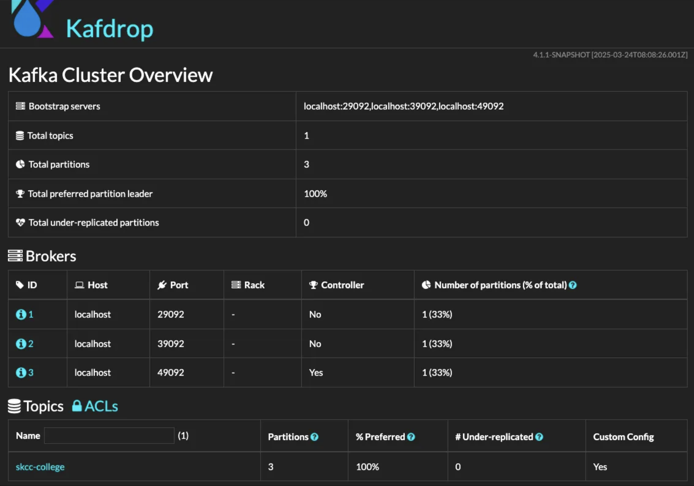

https://kafka.apache.org/

### **1. Kafka download**

```bash
$ cd /config/workspace
$ curl -O -s 'https://dlcdn.apache.org/kafka/3.8.0/kafka_2.13-3.8.0.tgz'
$ tar -xzf kafka_2.13-3.8.0.tgz
$ cd kafka_2.13-3.8.0
```

### **2. Kafka with ZooKeeper**

```bash
# 터미널 새창 실행
# Start the ZooKeeper service
$ ./bin/zookeeper-server-start.sh config/zookeeper.properties

# 터미널 새창 실행
# kafka folder 이동
cd /config/workspace/kafka_2.13-3.8.0
# Start the Kafka broker service
$ ./bin/kafka-server-start.sh config/server.properties

# 새터미널 실행
$ netstat -ntlp | grep 2181
...
tcp6       0      0 :::2181                 :::*                    LISTEN      16128/java

$ netstat -ntlp | grep 9092
...
tcp6       0      0 :::9092                 :::*                    LISTEN      16817/java

cd /config/workspace/kafka_2.13-3.8.0
# 토픽생성
./bin/kafka-topics.sh --create --bootstrap-server localhost:9092 --replication-factor 1 --partitions 3 --topic skcc-college

# 토픽목록
./bin/kafka-topics.sh --bootstrap-server localhost:9092 --list

# 토픽상세
./bin/kafka-topics.sh --bootstrap-server localhost:9092 --describe --topic skcc-college
Created topic skcc-college.
[2025-03-24 15:53:28,063] WARN [AdminClient clientId=adminclient-1] The DescribeTopicPartitions API is not supported, using Metadata API to describe topics. (org.apache.kafka.clients.admin.KafkaAdminClient)
Topic: skcc-college     TopicId: xp_CFb3yTxeJBbrTeaSnvg PartitionCount: 3       ReplicationFactor: 1    Configs: 
        Topic: skcc-college     Partition: 0    Leader: 0       Replicas: 0     Isr: 0  Elr: N/A        LastKnownElr: N/A
        Topic: skcc-college     Partition: 1    Leader: 0       Replicas: 0     Isr: 0  Elr: N/A        LastKnownElr: N/A
        Topic: skcc-college     Partition: 2    Leader: 0       Replicas: 0     Isr: 0  Elr: N/A        LastKnownElr: N/A
        
# 상태 확인
./bin/zookeeper-shell.sh localhost:2181

ls /brokers/ids
ls /brokers/topics

quit
```

### **3. Kafka with KRaft**

```bash
**# 이전 실행중인 Kafka 프로세스는 종료**

$ cd /config/workspace/kafka_2.13-3.8.0
# Generate a Cluster UUID
$ KAFKA_CLUSTER_ID="$(bin/kafka-storage.sh random-uuid)"

$ echo $KAFKA_CLUSTER_ID
# lTqo8r9sSF2ALk4252ybag <= 환경마다, 실행시마다 다른 값이 생성됨

# Format Log Directories
$ ./bin/kafka-storage.sh format -t $KAFKA_CLUSTER_ID -c config/kraft/server.properties
# Formatting /tmp/kraft-combined-logs with metadata.version 3.8-IV0.

# Start the Kafka Server
$ ./bin/kafka-server-start.sh config/kraft/server.properties

# 새터미널 실행
# 설치 확인
netstat -ntlp
(Not all processes could be identified, non-owned process info
 will not be shown, you would have to be root to see it all.)
Active Internet connections (only servers)
Proto Recv-Q Send-Q Local Address           Foreign Address         State       PID/Program name
......
tcp6       0      0 :::9093                 :::*                    LISTEN      20813/java
tcp6       0      0 :::9092                 :::*                    LISTEN      20813/java

$ cd /config/workspace/kafka_2.13-3.8.0

# 토픽생성
./bin/kafka-topics.sh --create --bootstrap-server localhost:9092 --replication-factor 1 --partitions 3 --topic skcc-college
Created topic skcc-college.

# 토픽목록
./bin/kafka-topics.sh --bootstrap-server localhost:9092 --list

# 토픽상세
./bin/kafka-topics.sh --bootstrap-server localhost:9092 --describe --topic skcc-college

```

### **4. Kafka Cluster with KRaft**

```bash
**# 이전 실행중인 Kafka 프로세스는 종료**

# 공통 설정
cd /config/workspace
git clone https://github.com/n06919/kafka_cluster.git

cd ~/workspace/kafka_2.13-3.8.0

ln -s /config/workspace/kafka_cluster/server server

# ls -al
# drwxr-xr-x   11 a10941  staff    352  3 24 10:56 .
# drwxr-xr-x    5 a10941  staff    160  3 24 10:55 ..
# -rw-r--r--    1 a10941  staff  15295  7 23  2024 LICENSE
# -rw-r--r--    1 a10941  staff  28359  7 23  2024 NOTICE
# drwxr-xr-x   45 a10941  staff   1440  7 23  2024 bin
# drwxr-xr-x   18 a10941  staff    576  3 24 10:49 config
# drwxr-xr-x  124 a10941  staff   3968  7 23  2024 libs
# drwxr-xr-x   16 a10941  staff    512  7 23  2024 licenses
# drwxr-xr-x   12 a10941  staff    384  3 24 10:54 logs
**# lrwxr-xr-x    1 a10941  staff     60  3 24 10:56 server -> /config/workspace/kafka_cluster/server/**
# drwxr-xr-x    3 a10941  staff     96  7 23  2024 site-docs

bin/kafka-storage.sh random-uuid > ~/workspace/kafka_2.13-3.8.0/cluster.id

export KAFKA_CLUSTER_ID=$(cat cluster.id)

# 설정된 환경 변수 출력 (필요 시)
echo "KAFKA_CLUSTER_ID is set to: $KAFKA_CLUSTER_ID"

# 새로운 터미털 3개 필요

```

- kafka-server1:
    
    ```bash
    # 터미널 새창-1 (zsh -> server1 로 rename)
    
    cd ~/workspace/kafka_2.13-3.8.0
     
    export KAFKA_CLUSTER_ID=$(cat cluster.id)
    
    # Format Log Directories
    $ ./bin/kafka-storage.sh format -t ${KAFKA_CLUSTER_ID} -c server/kafka-server1/config/server.properties
    
    출력: 
    Formatting server/kafka-server1/data with metadata.version 3.8-IV0.
    
    # Start the Kafka Server
    $ export LOG_DIR=./server/kafka-server1/logs
    $ ./bin/kafka-server-start.sh server/kafka-server1/config/server.properties
    
    ```
    
- kafka-server2:
    
    ```bash
    cd ~/workspace/kafka_2.13-3.8.0
    
    # 터미널 새창-2 (zsh -> server2 로 rename)
    export KAFKA_CLUSTER_ID=$(cat cluster.id)
    
    # Format Log Directories
    $ ./bin/kafka-storage.sh format -t ${KAFKA_CLUSTER_ID} -c server/kafka-server2/config/server.properties
    출력:
    Formatting server/kafka-server2/data with metadata.version 3.8-IV0.
    
    # Start the Kafka Server
    $ export LOG_DIR=./server/kafka-server2/logs
    $ ./bin/kafka-server-start.sh server/kafka-server2/config/server.properties
    
    ```
    
- kafka-server3:
    
    ```bash
    cd ~/workspace/kafka_2.13-3.8.0
    
    # 터미널 새창-3 (zsh -> server3 로 rename)
    export KAFKA_CLUSTER_ID=$(cat cluster.id)
    
    # Format Log Directories
    $ ./bin/kafka-storage.sh format -t ${KAFKA_CLUSTER_ID} -c server/kafka-server3/config/server.properties
    출력:
    Formatting server/kafka-server3/data with metadata.version 3.8-IV0.
    
    # Start the Kafka Server
    $ export LOG_DIR=./server/kafka-server3/logs
    $ ./bin/kafka-server-start.sh server/kafka-server3/config/server.properties
    ```
    
    ```bash
    # 새터미널 실행
    # 설치 확인 (포트 29092, 29093, 39092, 39093, 49092, 49093)
    netstat -ntlp
    (Not all processes could be identified, non-owned process info
     will not be shown, you would have to be root to see it all.)
    Active Internet connections (only servers)
    Proto Recv-Q Send-Q Local Address           Foreign Address         State       PID/Program name    
    ... 중략 ...(출력 순서는 다르게 표시됨)
    
    tcp6       0      0 :::29092                :::*                    LISTEN      185171/java         
    tcp6       0      0 :::29093                :::*                    LISTEN      185171/java   
    
    tcp6       0      0 :::39092                :::*                    LISTEN      186544/java         
    tcp6       0      0 :::39093                :::*                    LISTEN      186544/java         
    
    tcp6       0      0 :::49092                :::*                    LISTEN      187996/java         
    tcp6       0      0 :::49093                :::*                    LISTEN      187996/java         
                       
    ~/workspace (⎈|default-system:sk-edu)
    ```
    

```bash

# replication
./bin/kafka-metadata-quorum.sh \
--bootstrap-server localhost:49092 \
describe --replication
NodeId	LogEndOffset	Lag	LastFetchTimestamp	LastCaughtUpTimestamp	Status
1     	198         	0  	1742781755188     	1742781755188        	Leader
2     	198         	0  	1742781754736     	1742781754736        	Follower
3     	198         	0  	1742781754732     	1742781754732        	Follower

# status
./bin/kafka-metadata-quorum.sh \
--bootstrap-server localhost:49092 \
describe --status
ClusterId:              203c-toGRAqtgJvsUfs8Ww
LeaderId:               1
LeaderEpoch:            38
HighWatermark:          282
MaxFollowerLag:         0
MaxFollowerLagTimeMs:   0
CurrentVoters:          [1,2,3]
CurrentObservers:       []

# 토픽 생성 
# replication-factor 3, partitions 3
./bin/kafka-topics.sh --create --bootstrap-server localhost:49092 --replication-factor 3 --partitions 3 --topic skcc-college
Created topic skcc-college.

./bin/kafka-topics.sh --bootstrap-server localhost:49092 --describe --topic skcc-college

Topic: skcc-college	TopicId: vs1EcTbnQKOypPLn64CjJw	PartitionCount: 3	ReplicationFactor: 3	Configs: segment.bytes=1073741824
	Topic: skcc-college	Partition: 0	Leader: 1	Replicas: 1,2,3	Isr: 1,2,3	Elr: 	LastKnownElr:
	Topic: skcc-college	Partition: 1	Leader: 2	Replicas: 2,3,1	Isr: 2,3,1	Elr: 	LastKnownElr:
	Topic: skcc-college	Partition: 2	Leader: 3	Replicas: 3,1,2	Isr: 3,1,2	Elr: 	LastKnownElr:
	
# 설정 변경 (retention.bytes = 1073741824)
./bin/kafka-configs.sh --bootstrap-server localhost:49092 --entity-type topics --entity-name skcc-college --alter --add-config retention.bytes=1073741824

# retention.bytes 추가 확인
./bin/kafka-topics.sh --bootstrap-server localhost:49092 --describe --topic skcc-college 
Topic: skcc-college     TopicId: a8f11hTRQYucz5BxGU0AvA PartitionCount: 3       ReplicationFactor: 3    Configs: segment.bytes=1073741824,retention.bytes=1073741824
        Topic: skcc-college     Partition: 0    Leader: 2       Replicas: 2,3,1 Isr: 2,3,1      Elr:    LastKnownElr: 
        Topic: skcc-college     Partition: 1    Leader: 3       Replicas: 3,1,2 Isr: 3,1,2      Elr:    LastKnownElr: 
        Topic: skcc-college     Partition: 2    Leader: 1       Replicas: 1,2,3 Isr: 1,2,3      Elr:    LastKnownElr: 
```

<참고>

```bash
# 프로세스 확인
macos: 
	sudo lsof -i :29092
	sudo lsof -i :29093
	sudo lsof -i :39092
	sudo lsof -i :39093
	sudo lsof -i :49092
	sudo lsof -i :49093

linux: netstat -nltp
Active Internet connections (only servers)
Proto Recv-Q Send-Q Local Address           Foreign Address         State       PID/Program name
....
tcp6       0      0 :::49093                :::*                    LISTEN      29953/java
tcp6       0      0 :::49092                :::*                    LISTEN      29953/java
tcp6       0      0 :::39093                :::*                    LISTEN      28909/java
tcp6       0      0 :::39092                :::*                    LISTEN      28909/java
tcp6       0      0 :::29093                :::*                    LISTEN      27881/java
tcp6       0      0 :::29092                :::*                    LISTEN      27881/java

./bin/kafka-metadata-quorum.sh --bootstrap-server localhost:29092,localhost:39092,localhost:49092 describe --status
<결과>
ClusterId:              3w_N6UFnShO9gdNMTThAcw
LeaderId:               1
LeaderEpoch:            20
HighWatermark:          5753
MaxFollowerLag:         0
MaxFollowerLagTimeMs:   0
CurrentVoters:          [1,2,3]
CurrentObservers:       []

./bin/kafka-metadata-quorum.sh --bootstrap-server localhost:29092,localhost:39092,localhost:49092 describe --replication
<결과>
NodeId  LogEndOffset    Lag     LastFetchTimestamp      LastCaughtUpTimestamp   Status
1       330             0       1726135482998           1726135482998           Leader
2       330             0       1726135482746           1726135482746           Follower
3       330             0       1726135482744           1726135482744           Follower

./bin/kafka-topics.sh --create --bootstrap-server localhost:29092 --replication-factor 3 --partitions 3 --topic skcc-college

./bin/kafka-topics.sh --bootstrap-server localhost:29092 --describe --topic skcc-college
<결과>
Topic: skcc-college     TopicId: nip_zlM8QuO8rWFrFBTPyg PartitionCount: 3       ReplicationFactor: 3    Configs: segment.bytes=1073741824
        Topic: skcc-college     Partition: 0    Leader: 1       Replicas: 1,2,3 Isr: 1,2,3      Elr:    LastKnownElr:
        Topic: skcc-college     Partition: 1    Leader: 2       Replicas: 2,3,1 Isr: 2,3,1      Elr:    LastKnownElr:
        Topic: skcc-college     Partition: 2    Leader: 3       Replicas: 3,1,2 Isr: 3,1,2      Elr:    LastKnownElr:

```

### **5. Kafka Web UI**

```bash
# 터미널 새창 (창이름 변경 - kafdrop)
git clone https://github.com/obsidiandynamics/kafdrop.git
cd kafdrop
./mvnw clean package -DskipTests

java --add-opens=java.base/sun.nio.ch=ALL-UNNAMED \
    -jar target/kafdrop-4.1.1-SNAPSHOT.jar \
    --kafka.brokerConnect=localhost:29092,localhost:39092,localhost:49092
    

IDE > PORTS 탭 > 9000 포트 확인 (없으면 Add Port)
```



### **6. Using JVM Based Apache Kafka Docker Image**

```bash
alias docker=/bin/podman

# 이미지 다운로드
$ docker pull docker.io/apache/kafka:3.8.0

# 실행
$ docker run -p 59092:9092 apache/kafka:3.8.0

<로컬테스트>
# 토픽생성
./bin/kafka-topics.sh --create --bootstrap-server localhost:59092 --replication-factor 1 --partitions 3 --topic skcc-college

# 토픽상세
./bin/kafka-topics.sh --bootstrap-server localhost:59092 --describe --topic skcc-college

<도커 컨테이너>
sudo docker ps --all

sudo docker exec -it <CONTAINER ID> bash
cd /opt/kafka
# 토픽생성
./bin/kafka-topics.sh --create --bootstrap-server localhost:9092 --replication-factor 1 --partitions 3 --topic skcc-college-2

# 토픽상세
./bin/kafka-topics.sh --bootstrap-server localhost:9092 --describe --topic skcc-college-2

# 환경정보 조회
./bin/kafka-configs.sh --bootstrap-server localhost:9092 --entity-type brokers --entity-name 1 --describe --all
```