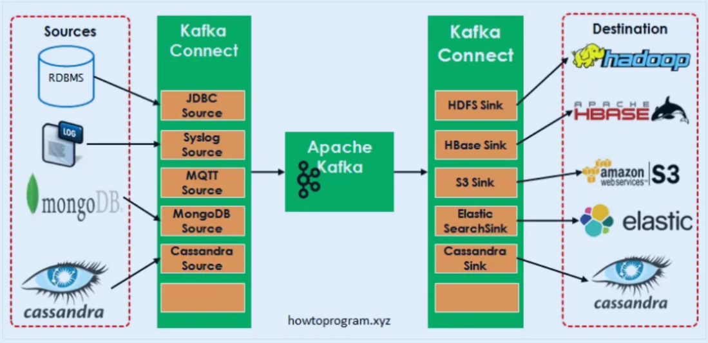
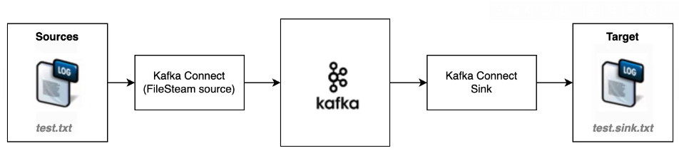

## 개요

Kafka Connect는 Kafka를 사용하여 다른 시스템과 데이터를 주고 받기 위한 오픈소스 프레임워크이다. 

Kafka Connect에는 기존 시스템에 연결하여 Kafka와 데이터를 주고 받는 데 도움이 되는 다양한 내장 Connector를 제공해주고 있다.


Apache Kafka Connect Overview

## Kafka Connect의 특징과 장점

- 반복적인 파이프라인 생성 작업시 매번 프로듀서 컨슈머 어플리케이션을 개발하고 배포, 운영 하는것은 비효율적이다
- Connector를 이용하면 특정한 작업 형태를 템플릿으로 만들어 놓은 Connector를 실행함으로써 반복작업을 줄일 수 있다
    - Business 로직에만 집중할 수 있고, 내부 시스템 코드도 더욱 단순화되는 장점이 있다
- Connector는 2가지 타입이 존재한다
    - Source Connector는 외부 시스템에서 Kafka로 데이터를 넣어주는 Connector이다 (External System -> Kafka)
    - Sink Connector는 Kafka에서 데이터를 꺼내 외부 시스템에 데이터를 넣어주는 Connector이다. (Kafka -> External System)
- 다양한 Connector들이 존재 (ex. 오픈소스, 유료)하고 개발자들도 직접 원하는 Connector를 개발할 수 있다
    - MongoDB, JDBC, Redis, HTTP, S3, Elasticsearch, AWS Lambda, etc
    - [Connector 목록](https://www.confluent.io/product/connectors/?utm_medium=sem&utm_source=google&utm_campaign=ch.sem_br.nonbrand_tp.prs_tgt.kafka-connectors_mt.mbm_rgn.apac_lng.eng_dv.all_con.kafka-connectors&utm_term=%2Bkafka+%2Bconnector&placement=&device=c&creative=&gclid=CjwKCAjwopWSBhB6EiwAjxmqDQK_IP1BwHGk2QuxnbEMBpLSzpELe-SxeCH5U_kd8VdmaM22beSGTBoC4yEQAvD_BwE)
    - [Confluent Hub](https://www.confluent.io/hub/?_ga=2.105942858.818878415.1648561146-1727219079.1644563166&_gac=1.183425876.1648562015.Cj0KCQjw3IqSBhCoARIsAMBkTb3IVhJSR686GZrLNaiMPSNYbde-qKWCTOL8TR0_Hdew4qqm6MDPY4saAv1kEALw_wcB) - Connector App Store

## **구성요소 및 동작 원리**

Kafka Connect는 크게 5가지 요소로 되어 있다.

- Worker
    - Connector와 task를 실행하는 프로세스이다
    - Worker는 REST API 요청에 대한 처리를 담당한다
        - Connector 등록, 설정, 시작, 종료등의 처리를 해준다
    - 2가지 모드를 지원한다
        - standalone : 하나의 process가 connector와 task 실행을 시킨다
        - distributed
            - 분사 모드는 kafka connect의 확장성과 자동 결함 허용 기능을 제공한다
            - 여러 worker 프로세스로 실행시킬 수 있다
- Connector
    - Connector는 파이프라인에 대한 추상 객체이고 Task들을 관리하는 역할을 한다
        - 실행할 작업 수를 결정하고 Task 간의 작업을 나누는 작업
        - Worker로부터 Task를 위한 설정 값을 가져오고 Task에게 전달하는 작업
    - 실제 Worker가 Task를 구동시킨다
- Task
    - Kafka로부터 데이터를 가져오고나 넣는 작업을 하고 실제 파이프라인 동작 요소이다
    - Source Task는 source system으로 부터 데이터를 poll하고 worker는 가져온 데이터를 Kafka topic으로 보낸다
    - Sink Task는 Kafka로부터 Worker를 통해 record를 가져오고 sink system에 record를 쓴다
    - Task Rebalancing 기능도 제공한다
- Converter
    - Worker가 데이터를 수신하면 converter를 사용하여 데이터를 적절한 형식으로 변환한다
- Transform
    - Connector를 통해 흘러가는 각 메시지에 대해 변환하는 역할을 한다

## 실습



**config/connect-file-source.properties (외부 시스템과 Kafka 간의 데이터 전송을 담당)**

```bash
# 커넥터 인스턴스의 고유한 이름
name=local-file-source

# 사용할 커넥터 클래스를 지정
connector.class=FileStreamSource

# 커넥터 인스턴스에 대해 실행할 최대 태스크 수
tasks.max=1

# 입력 파일의 이름을 지정, 작업자의 현재 작업 디렉토리를 기준으로 한 상대 경로
file=test.txt

# 데이터를 전송할 Kafka 토픽을 지정, 소스 커넥터는 단일 출력 토픽만 지정할 수 있음
topic=connect-test
```

**config/connect-file-sink.properties (Kafka의 데이터를 소비하여 외부 시스템에 저장)**

```bash
# 커넥터 인스턴스의 고유한 이름
name=local-file-sink 

# 사용할 커넥터 클래스를 지정 - FileStreamSink는 Kafka에서 데이터를 읽어 로컬 파일에 출력하는 싱크 커넥터
connector.class=FileStreamSink

# 커넥터 인스턴스에 대해 실행할 최대 태스크 수
tasks.max=1

# 출력 파일의 이름, 작업자의 현재 작업 디렉토리를 기준으로 한 상대 경로
file=test.sink.txt

# 데이터를 읽어올 Kafka 토픽, 여러 토픽을 지정할 경우 쉼표로 구분
topics=connect-test
```

- FileStream connect 는 학습 및 데모 목적으로 사용, 운영 환경에서는 Spool Dir connector와 같은 더 강력하고 안정적인 방법을 사용

```bash
$ cd ~/workspace/kafka_2.13-3.8.0
$ echo "plugin.path=libs/connect-file-3.8.0.jar" >> config/connect-standalone.properties
$ echo -e "foo\nbar" > test.txt

# 토픽생성
$ ./bin/kafka-topics.sh --create --bootstrap-server localhost:9092 --replication-factor 1 --partitions 1 --topic connect-test
```

```bash
# 새창
$ cd ~/workspace/kafka_2.13-3.8.0

# connect 실행 
$ ./bin/connect-standalone.sh config/connect-standalone.properties config/connect-file-source.properties config/connect-file-sink.properties
```

```bash
# consumer 용 새창
$ cd ~/workspace/kafka_2.13-3.8.0

$ ./bin/kafka-console-consumer.sh --bootstrap-server localhost:9092 --topic connect-test --from-beginning
{"schema":{"type":"string","optional":false},"payload":"foo"}
{"schema":{"type":"string","optional":false},"payload":"bar"}
```

```bash
# 새창
$ cd ~/workspace/kafka_2.13-3.8.0
$ echo "Another line" >> test.txt

# consumer 용 창
{"schema":{"type":"string","optional":false},"payload":"foo"}
{"schema":{"type":"string","optional":false},"payload":"bar"}
{"schema":{"type":"string","optional":false},"payload":"Another line"} <= 추가로 출력
```

### 과제

```bash
과제: kafka-console-producer.sh 를 실행하여 사용자 입력데이터 test-out.sink.txt 로 출력하는 kafka connect 를 구성하세요.
토픽: topic=connect-test-ex

# **config/connect-file-sink.properties**
name=local-file-sink-ex
file=test-out.sink.txt
topic=connect-test-ex
```

- …
    
    ```bash
    # connect 실행
    ./bin/connect-standalone.sh config/connect-standalone.properties config/connect-file-sink.properties
    
    # consumer
    ./bin/kafka-console-consumer.sh --bootstrap-server localhost:9092 --topic connect-test-ex --from-beginning
    
    # producer
    ./bin/kafka-console-producer.sh --topic connect-test-ex --bootstrap-server localhost:9092
    입력: {"schema":{"type":"string","optional":false},"payload":"Another line input - 1"}
    ```