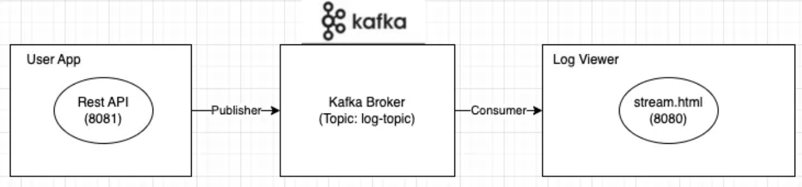

# log stream



```bash

git clone https://github.com/2024-college/log-stream.git

cd log-stream
```

### Start Kafka

```bash
# Generate a Cluster UUID
$ KAFKA_CLUSTER_ID="$(bin/kafka-storage.sh random-uuid)"
$ echo $KAFKA_CLUSTER_ID
# Format Log Directories
$ ./bin/kafka-storage.sh format -t $KAFKA_CLUSTER_ID -c config/kraft/server.properties

# Start the Kafka Server
$ ./bin/kafka-server-start.sh config/kraft/server.properties

- broker port: 9092
- topic : log-topic
- consumer group : log-consumer-group

./bin/kafka-topics.sh --create --bootstrap-server localhost:9092 --replication-factor 1 --partitions 1 --topic log-topic

./bin/kafka-topics.sh --bootstrap-server localhost:9092 --describe --topic log-topic
```

### Start Producer

```bash
cd log-stream
./gradlew runProducer
```

### Start Consumer

```bash
cd log-stream

# 코드 수정
src/main/resources/static/stream.html
<39라인>
var socket = new WebSocket("wss://skcc06919-kafka-edu-pod-testp8080nsk-edu.remote.ags-rde.skamdp.org/logs"); // 8080 사용하는 주소

./gradlew runConsumer

# 웹브라우저
https://skcc06919-kafka-edu-pod-testp8080nsk-edu.remote.ags-rde.skamdp.org/stream.html
```

테스트

```bash
# 새터미널

# info 로그
curl -X GET http://localhost:8081/test/info

## error 로그
curl -X GET http://localhost:8081/test/error
```